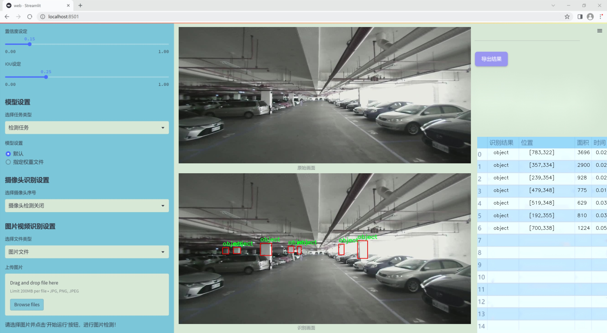
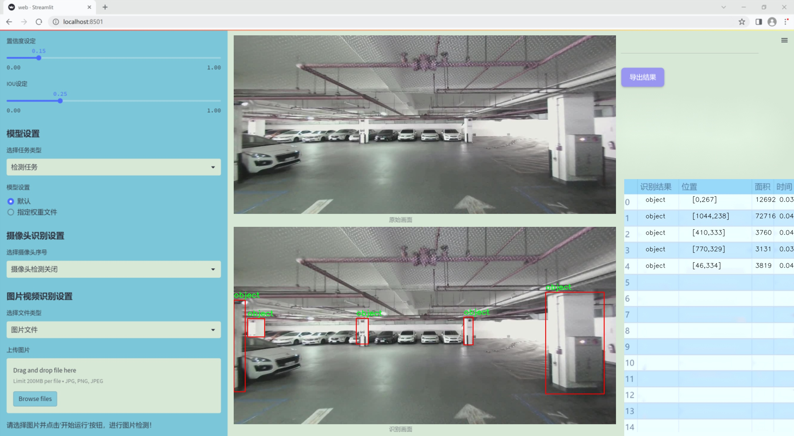
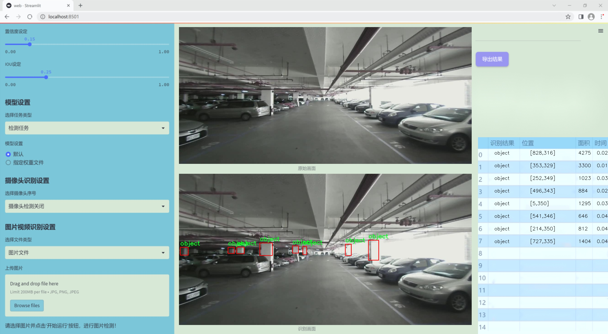
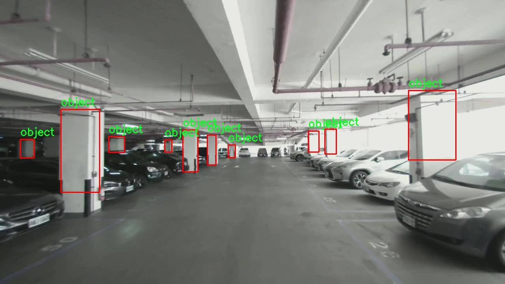
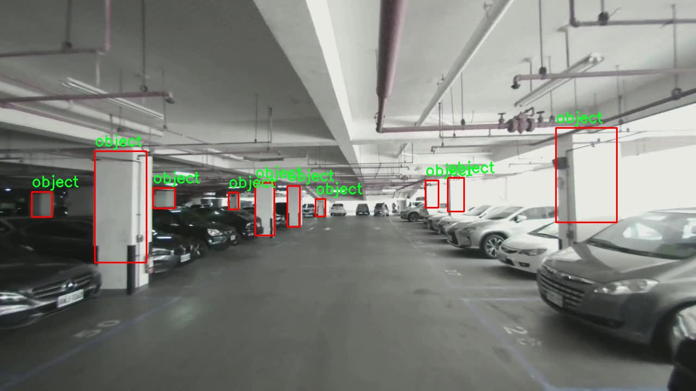
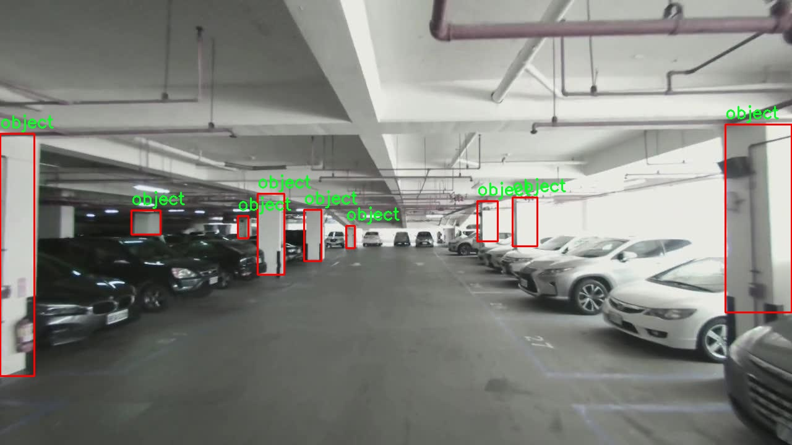
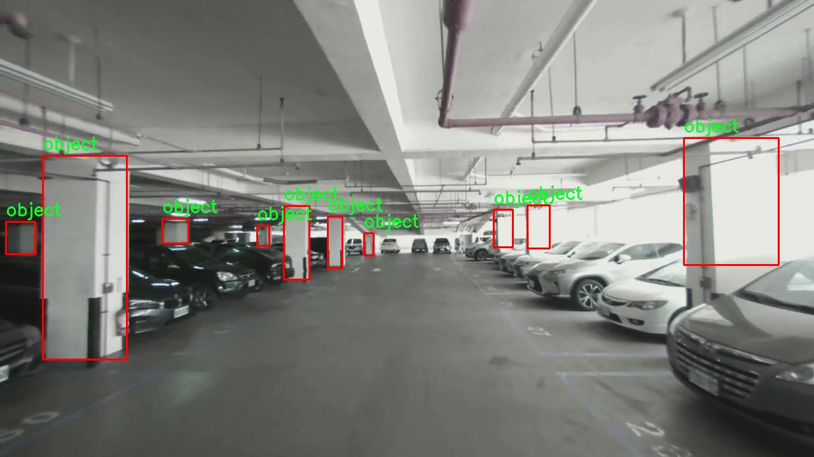
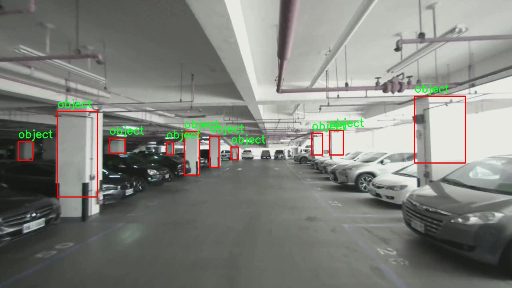

### 1.背景意义

研究背景与意义

随着城市化进程的加快，停车场的管理与监控变得愈发重要。停车场不仅是车辆停放的场所，更是城市交通管理的关键节点。传统的停车场管理方式往往依赖人工巡查，效率低下且容易出错。为了解决这一问题，基于计算机视觉的自动化检测系统应运而生，能够实时监控停车场内的车辆、行人及其他物体，提升管理效率和安全性。

在众多计算机视觉技术中，YOLO（You Only Look Once）系列模型因其高效的实时检测能力而备受关注。YOLOv11作为该系列的最新版本，结合了深度学习的先进技术，能够在复杂场景中快速、准确地识别和定位目标物体。然而，停车场环境的复杂性，如光照变化、视角不同及遮挡现象，给物体检测带来了挑战。因此，改进YOLOv11以适应停车场柱子及车辆的检测，具有重要的实际意义。

本研究所使用的数据集包含1300幅图像，涵盖了四个类别：车辆、物体、行人和柱子。这些类别的选择不仅反映了停车场环境的多样性，也为模型的训练提供了丰富的样本。通过对这些数据的分析与处理，可以有效提升YOLOv11在停车场场景中的检测精度和鲁棒性。此外，针对停车场柱子的特定检测需求，改进后的模型将能够更好地识别和定位柱子，减少因柱子遮挡导致的误检和漏检现象。

综上所述，基于改进YOLOv11的停车场柱子检测系统，不仅能够提升停车场的管理效率，还能为城市交通管理提供重要的数据支持，具有广泛的应用前景和社会价值。

### 2.视频效果

[2.1 视频效果](https://www.bilibili.com/video/BV1mVkwYcEAS/)

### 3.图片效果







##### [项目涉及的源码数据来源链接](https://kdocs.cn/l/cszuIiCKVNis)**

注意：本项目提供训练的数据集和训练教程,由于版本持续更新,暂不提供权重文件（best.pt）,请按照6.训练教程进行训练后实现上图演示的效果。

### 4.数据集信息

##### 4.1 本项目数据集类别数＆类别名

nc: 4
names: ['car', 'object', 'person', 'pillar']


该项目为【目标检测】数据集，请在【训练教程和Web端加载模型教程（第三步）】这一步的时候按照【目标检测】部分的教程来训练

##### 4.2 本项目数据集信息介绍

本项目数据集信息介绍

本项目旨在改进YOLOv11的停车场柱子检测系统，因此构建了一个专门针对“pillar_and_car”主题的数据集。该数据集包含四个主要类别，分别为“car”（汽车）、“object”（物体）、“person”（行人）和“pillar”（柱子），这些类别的选择是基于停车场环境中常见的元素，以确保模型能够在实际应用中高效识别和分类。数据集的类别数量为四，涵盖了与停车场相关的关键对象，能够有效支持柱子检测任务的训练和评估。

在数据集的构建过程中，我们收集了大量的图像，确保每个类别的样本数量均衡，覆盖不同的场景和光照条件。这些图像不仅包括停车场的全景视图，还包括特写镜头，以便模型能够学习到柱子与其他对象之间的相对位置关系。此外，为了提高模型的鲁棒性，数据集中还包含了不同天气条件下的图像，如晴天、阴天和雨天等，确保模型在各种环境下都能保持良好的检测性能。

每个图像都经过精确标注，确保柱子、汽车、行人及其他物体的边界框清晰可见。这样的标注方式不仅有助于模型学习目标的特征，还能提高其在复杂场景中的识别能力。通过对这些多样化数据的训练，期望能够显著提升YOLOv11在停车场柱子检测任务中的准确性和效率，为智能停车系统的进一步发展奠定坚实的基础。整体而言，本数据集的设计和构建充分考虑了实际应用需求，力求为模型提供丰富的学习素材，以实现更高的检测性能。











### 5.全套项目环境部署视频教程（零基础手把手教学）

[5.1 所需软件PyCharm和Anaconda安装教程（第一步）](https://www.bilibili.com/video/BV1BoC1YCEKi/?spm_id_from=333.999.0.0&vd_source=bc9aec86d164b67a7004b996143742dc)


[5.2 安装Python虚拟环境创建和依赖库安装视频教程（第二步）](https://www.bilibili.com/video/BV1ZoC1YCEBw?spm_id_from=333.788.videopod.sections&vd_source=bc9aec86d164b67a7004b996143742dc)

### 6.改进YOLOv11训练教程和Web_UI前端加载模型教程（零基础手把手教学）

[6.1 改进YOLOv11训练教程和Web_UI前端加载模型教程（第三步）](https://www.bilibili.com/video/BV1BoC1YCEhR?spm_id_from=333.788.videopod.sections&vd_source=bc9aec86d164b67a7004b996143742dc)


按照上面的训练视频教程链接加载项目提供的数据集，运行train.py即可开始训练



     Epoch   gpu_mem       box       obj       cls    labels  img_size
     1/200     20.8G   0.01576   0.01955  0.007536        22      1280: 100%|██████████| 849/849 [14:42<00:00,  1.04s/it]
               Class     Images     Labels          P          R     mAP@.5 mAP@.5:.95: 100%|██████████| 213/213 [01:14<00:00,  2.87it/s]
                 all       3395      17314      0.994      0.957      0.0957      0.0843

     Epoch   gpu_mem       box       obj       cls    labels  img_size
     2/200     20.8G   0.01578   0.01923  0.007006        22      1280: 100%|██████████| 849/849 [14:44<00:00,  1.04s/it]
               Class     Images     Labels          P          R     mAP@.5 mAP@.5:.95: 100%|██████████| 213/213 [01:12<00:00,  2.95it/s]
                 all       3395      17314      0.996      0.956      0.0957      0.0845

     Epoch   gpu_mem       box       obj       cls    labels  img_size
     3/200     20.8G   0.01561    0.0191  0.006895        27      1280: 100%|██████████| 849/849 [10:56<00:00,  1.29it/s]
               Class     Images     Labels          P          R     mAP@.5 mAP@.5:.95: 100%|███████   | 187/213 [00:52<00:00,  4.04it/s]
                 all       3395      17314      0.996      0.957      0.0957      0.0845


###### [项目数据集下载链接](https://kdocs.cn/l/cszuIiCKVNis)

### 7.原始YOLOv11算法讲解

YOLO11采用改进的骨干和颈部架构，增强了特征提取能力，提高了物体检测的精确度和复杂任务的表现。YOLO11引入精炼的架构设计和优化的训练流程，实现更快的处理速度，同时保持精度和性能之间的最佳平衡。通过模型设计的进步，YOLO11m在COCO数据集上实现了更高的均值平均精度（mAP），同时使用比YOLOv8m少22%的参数，使其在不妥协准确性的情况下更加计算高效。YOLO11可以无缝部署在各种环境中，包括边缘设备、云平台以及支持NVIDIA
GPU的系统，确保最大灵活性。无论是物体检测、实例分割、图像分类、姿态估计，还是定向物体检测（OBB），YOLO11都旨在应对多样的计算机视觉挑战。


##### **Ultralytics YOLO11相比于之前版本的主要改进有哪些？**

Ultralytics YOLO11在其前身基础上引入了几项重要进步。主要改进包括：

  1. **增强的特征提取** ：YOLO11采用改进的骨干和颈部架构，增强了特征提取能力，提高了物体检测的精确度。
  2.  **优化的效率和速度** ：精炼的架构设计和优化的训练流程实现了更快的处理速度，同时保持了准确性和性能之间的平衡。
  3.  **更高的准确性与更少的参数** ：YOLO11m在COCO数据集上实现了更高的均值平均精度（mAP），同时使用比YOLOv8m少22%的参数，使其在不妥协准确性的情况下更加计算高效。
  4.  **环境适应性强** ：YOLO11可以在多种环境中部署，包括边缘设备、云平台以及支持NVIDIA GPU的系统。
  5.  **支持广泛的任务** ：YOLO11支持多种计算机视觉任务，如物体检测、实例分割、图像分类、姿态估计和定向物体检测（OBB）。

我们先来看一下其网络结构有什么变化，可以看出，相比较于YOLOv8模型，其将CF2模块改成C3K2，同时在SPPF模块后面添加了一个C2PSA模块，且将YOLOv10的head思想引入到YOLO11的head中，使用深度可分离的方法，减少冗余计算，提高效率。下面我们来详细看一下这两个模块的结构是怎么构成的，以及它们为什么要这样设计


##### C3K2的网络结构

从下面图中我们可以看到，C3K2模块其实就是C2F模块转变出来的，它代码中有一个设置，就是当c3k这个参数为FALSE的时候，C3K2模块就是C2F模块，也就是说它的Bottleneck是普通的Bottleneck；反之当它为true的时候，将Bottleneck模块替换成C3模块。


##### C2PSA的网络结构

` `C2PSA是对 `C2f` 模块的扩展，它结合了PSA(Pointwise Spatial
Attention)块，用于增强特征提取和注意力机制。通过在标准 `C2f` 模块中引入 PSA
块，C2PSA实现了更强大的注意力机制，从而提高了模型对重要特征的捕捉能力。


##### **C2f 模块回顾：**

**** C2f模块是一个更快的 CSP（Cross Stage Partial）瓶颈实现，它通过两个卷积层和多个 Bottleneck
块进行特征提取。相比传统的 CSPNet，C2f 优化了瓶颈层的结构，使得计算速度更快。在 C2f中，`cv1` 是第一个 1x1
卷积，用于减少通道数；`cv2` 是另一个 1x1 卷积，用于恢复输出通道数。而 `n` 是一个包含 Bottleneck 块的数量，用于提取特征。

##### **C2PSA 模块的增强** ：

**C2PSA** 扩展了 C2f，通过引入PSA( **Position-Sensitive Attention)**
，旨在通过多头注意力机制和前馈神经网络来增强特征提取能力。它可以选择性地添加残差结构（shortcut）以优化梯度传播和网络训练效果。同时，使用FFN
可以将输入特征映射到更高维的空间，捕获输入特征的复杂非线性关系，允许模型学习更丰富的特征表示。

##### head部分

YOLO11在head部分的cls分支上使用深度可分离卷积 ，具体代码如下，cv2边界框回归分支，cv3分类分支。

    
    
     self.cv2 = nn.ModuleList(
                nn.Sequential(Conv(x, c2, 3), Conv(c2, c2, 3), nn.Conv2d(c2, 4 * self.reg_max, 1)) for x in ch
            )
            self.cv3 = nn.ModuleList(
                nn.Sequential(
                    nn.Sequential(DWConv(x, x, 3), Conv(x, c3, 1)),
                    nn.Sequential(DWConv(c3, c3, 3), Conv(c3, c3, 1)),
                    nn.Conv2d(c3, self.nc, 1),
                )
                for x in ch
            )


### 8.200+种全套改进YOLOV11创新点原理讲解

#### 8.1 200+种全套改进YOLOV11创新点原理讲解大全

由于篇幅限制，每个创新点的具体原理讲解就不全部展开，具体见下列网址中的改进模块对应项目的技术原理博客网址【Blog】（创新点均为模块化搭建，原理适配YOLOv5~YOLOv11等各种版本）

[改进模块技术原理博客【Blog】网址链接](https://gitee.com/qunmasj/good)


#### 8.2 精选部分改进YOLOV11创新点原理讲解

###### 这里节选部分改进创新点展开原理讲解(完整的改进原理见上图和[改进模块技术原理博客链接](https://gitee.com/qunmasj/good)【如果此小节的图加载失败可以通过CSDN或者Github搜索该博客的标题访问原始博客，原始博客图片显示正常】
### CBAM空间注意力机制
近年来，随着深度学习研究方向的火热，注意力机制也被广泛地应用在图像识别、语音识别和自然语言处理等领域，注意力机制在深度学习任务中发挥着举足轻重的作用。注意力机制借鉴于人类的视觉系统，例如，人眼在看到一幅画面时，会倾向于关注画面中的重要信息，而忽略其他可见的信息。深度学习中的注意力机制和人类视觉的注意力机制相似，通过扫描全局数据，从大量数据中选择出需要重点关注的、对当前任务更为重要的信息，然后对这部分信息分配更多的注意力资源，从这些信息中获取更多所需要的细节信息，而抑制其他无用的信息。而在深度学习中，则具体表现为给感兴趣的区域更高的权重，经过网络的学习和调整，得到最优的权重分配，形成网络模型的注意力，使网络拥有更强的学习能力，加快网络的收敛速度。
注意力机制通常可分为软注意力机制和硬注意力机制[4-5]。软注意力机制在选择信息时，不是从输入的信息中只选择1个，而会用到所有输入信息，只是各个信息对应的权重分配不同，然后输入网络模型进行计算;硬注意力机制则是从输入的信息中随机选取一个或者选择概率最高的信息，但是这一步骤通常是不可微的，导致硬注意力机制更难训练。因此，软注意力机制应用更为广泛，按照原理可将软注意力机制划分为:通道注意力机制（channel attention)、空间注意力机制(spatial attention）和混合域注意力机制(mixed attention)。
通道注意力机制的本质建立各个特征通道之间的重要程度，对感兴趣的通道进行重点关注，弱化不感兴趣的通道的作用;空间注意力的本质则是建模了整个空间信息的重要程度，然后对空间内感兴趣的区域进行重点关注，弱化其余非感兴趣区域的作用;混合注意力同时运用了通道注意力和空间注意力，两部分先后进行或并行，形成对通道特征和空间特征同时关注的注意力模型。

卷积层注意力模块(Convolutional Block Attention Module，CBAM）是比较常用的混合注意力模块，其先后集中了通道注意力模块和空间注意力模块，网络中加入该模块能有效提高网络性能，减少网络模型的计算量，模块结构如图所示。输入特征图首先经过分支的通道注意力模块，然后和主干的原特征图融合，得到具有通道注意力的特征图，接着经过分支的空间注意力模块，在和主干的特征图融合后，得到同时具有通道特征注意力和空间特征注意力的特征图。CBAM模块不改变输入特征图的大小，因此该模块是一个“即插即用”的模块，可以插入网络的任何位置。

通道注意力模块的结构示意图如图所示，通道注意力模块分支并行地对输入的特征图进行最大池化操作和平均池化操作，然后利用多层感知机对结果进行变换，得到应用于两个通道的变换结果，最后经过sigmoid激活函数将变换结果融合，得到具有通道注意力的通道特征图。

空间注意力模块示意图如图所示，将通道注意力模块输出的特征图作为该模块的输入特征图，首先对输入特征图进行基于通道的最大池化操作和平均池化操作，将两部分得到的结果拼接起来，然后通过卷积得到降为Ⅰ通道的特征图，最后通过sigmoid激活函数生成具有空间注意力的特征图。


### 9.系统功能展示

图9.1.系统支持检测结果表格显示

  图9.2.系统支持置信度和IOU阈值手动调节

  图9.3.系统支持自定义加载权重文件best.pt(需要你通过步骤5中训练获得)

  图9.4.系统支持摄像头实时识别

  图9.5.系统支持图片识别

  图9.6.系统支持视频识别

  图9.7.系统支持识别结果文件自动保存

  图9.8.系统支持Excel导出检测结果数据


### 10. YOLOv11核心改进源码讲解

#### 10.1 EfficientFormerV2.py

以下是对给定代码的核心部分进行提炼和详细注释的结果：

```python
import torch
import torch.nn as nn
import math
import itertools

class Attention4D(nn.Module):
    """ 
    4D注意力机制模块
    """
    def __init__(self, dim=384, key_dim=32, num_heads=8, attn_ratio=4, resolution=7, act_layer=nn.ReLU, stride=None):
        super().__init__()
        self.num_heads = num_heads  # 注意力头的数量
        self.scale = key_dim ** -0.5  # 缩放因子
        self.key_dim = key_dim  # 键的维度
        self.resolution = resolution if stride is None else math.ceil(resolution / stride)  # 解析度
        self.stride_conv = nn.Conv2d(dim, dim, kernel_size=3, stride=stride, padding=1, groups=dim) if stride else None  # 步幅卷积
        self.upsample = nn.Upsample(scale_factor=stride, mode='bilinear') if stride else None  # 上采样

        # 初始化查询、键、值的卷积层
        self.q = nn.Conv2d(dim, num_heads * key_dim, 1)
        self.k = nn.Conv2d(dim, num_heads * key_dim, 1)
        self.v = nn.Conv2d(dim, num_heads * attn_ratio * key_dim, 1)

        # 注意力偏置参数
        self.attention_biases = nn.Parameter(torch.zeros(num_heads, len(self._get_attention_offsets(resolution))))

    def forward(self, x):
        """ 前向传播 """
        B, C, H, W = x.shape  # B: 批量大小, C: 通道数, H: 高度, W: 宽度
        if self.stride_conv is not None:
            x = self.stride_conv(x)  # 应用步幅卷积

        # 计算查询、键、值
        q = self.q(x).flatten(2).permute(0, 1, 3, 2)  # (B, num_heads, N, key_dim)
        k = self.k(x).flatten(2).permute(0, 1, 2, 3)  # (B, num_heads, N, key_dim)
        v = self.v(x).flatten(2).permute(0, 1, 3, 2)  # (B, num_heads, N, attn_dim)

        # 计算注意力
        attn = (q @ k) * self.scale + self.attention_biases
        attn = attn.softmax(dim=-1)  # softmax归一化

        # 计算输出
        x = (attn @ v).transpose(2, 3).reshape(B, -1, self.resolution, self.resolution)
        if self.upsample is not None:
            x = self.upsample(x)  # 上采样
        return x

    def _get_attention_offsets(self, resolution):
        """ 计算注意力偏置的偏移量 """
        points = list(itertools.product(range(resolution), repeat=2))
        attention_offsets = {}
        idxs = []
        for p1 in points:
            for p2 in points:
                offset = (abs(p1[0] - p2[0]), abs(p1[1] - p2[1]))
                if offset not in attention_offsets:
                    attention_offsets[offset] = len(attention_offsets)
                idxs.append(attention_offsets[offset])
        return idxs

class EfficientFormerV2(nn.Module):
    """
    EfficientFormer V2 模型
    """
    def __init__(self, layers, embed_dims, num_classes=1000):
        super().__init__()
        self.patch_embed = nn.Conv2d(3, embed_dims[0], kernel_size=3, stride=2, padding=1)  # 初始嵌入层
        self.network = nn.ModuleList()  # 存储网络的各个层

        for i in range(len(layers)):
            # 构建每个阶段的块
            stage = self._build_stage(embed_dims[i], layers[i])
            self.network.append(stage)

    def _build_stage(self, dim, layers):
        """ 构建网络的每个阶段 """
        blocks = []
        for _ in range(layers):
            blocks.append(Attention4D(dim))  # 添加注意力模块
        return nn.Sequential(*blocks)

    def forward(self, x):
        """ 前向传播 """
        x = self.patch_embed(x)  # 通过嵌入层
        for block in self.network:
            x = block(x)  # 通过每个块
        return x

def efficientformerv2_s0(weights='', **kwargs):
    """ 创建 S0 版本的 EfficientFormerV2 """
    model = EfficientFormerV2(layers=[2, 2, 6, 4], embed_dims=[32, 48, 96, 176], **kwargs)
    if weights:
        model.load_state_dict(torch.load(weights))
    return model

if __name__ == '__main__':
    inputs = torch.randn((1, 3, 640, 640))  # 随机输入
    model = efficientformerv2_s0()  # 创建模型
    res = model(inputs)  # 前向传播
    print(res.size())  # 输出结果的尺寸
```

### 代码分析和注释说明：

1. **Attention4D 类**：实现了一个4D注意力机制模块。该模块包括查询、键、值的卷积层，并通过计算注意力权重来生成输出。注意力权重是通过对查询和键的点积进行缩放和softmax计算得到的。

2. **EfficientFormerV2 类**：这是整个模型的主类，负责构建网络结构。它通过嵌入层将输入图像转换为特征表示，并通过多个注意力模块进行处理。

3. **efficientformerv2_s0 函数**：这是一个工厂函数，用于创建特定配置的EfficientFormerV2模型（S0版本），并可选择加载预训练权重。

4. **主程序**：在主程序中，创建了一个随机输入并通过模型进行前向传播，输出结果的尺寸。

这些核心部分构成了EfficientFormerV2模型的基础结构，注意力机制是其关键特性之一。

这个文件实现了一个名为EfficientFormerV2的深度学习模型，主要用于图像处理任务。该模型的设计灵感来源于高效的Transformer架构，结合了卷积神经网络（CNN）的优点，以提高计算效率和性能。

首先，文件中定义了一些超参数和结构体，这些参数包括不同模型版本的宽度和深度配置。EfficientFormer的不同版本（如S0、S1、S2和L）具有不同的层数和通道数，适应不同的计算资源和应用需求。

接下来，文件中定义了多个类来构建模型的不同组件。Attention4D类实现了一个四维注意力机制，支持多头注意力，并可以通过卷积操作进行下采样。这个类的构造函数中定义了多个卷积层和归一化层，用于计算查询、键和值，并生成注意力权重。

LGQuery类用于生成局部查询，通过平均池化和卷积操作来处理输入特征图。Attention4DDownsample类则结合了注意力机制和下采样操作，以减少特征图的空间维度，同时保留重要信息。

Embedding类负责将输入图像转换为嵌入表示，可以选择不同的实现方式，包括轻量级卷积和注意力机制。Mlp类实现了一个多层感知机，使用1x1卷积来处理特征。

AttnFFN和FFN类分别实现了带有注意力机制的前馈网络和普通前馈网络，后者在输入上应用多层感知机。eformer_block函数用于构建EfficientFormer的基本模块，结合了注意力和前馈网络的功能。

EfficientFormerV2类是模型的核心，负责构建整个网络结构。它接受多个参数，包括层数、嵌入维度、下采样策略等。该类还实现了前向传播方法，处理输入数据并返回特征图。

最后，文件提供了几个函数（如efficientformerv2_s0、efficientformerv2_s1等）用于创建不同版本的EfficientFormerV2模型，并加载预训练权重。文件的最后部分包含了一个示例，展示了如何使用这些模型进行推理，并打印输出特征图的尺寸。

总体而言，这个文件实现了一个灵活且高效的图像处理模型，适用于各种计算资源和任务需求，充分利用了现代深度学习中的注意力机制和卷积操作。

#### 10.2 CSwomTramsformer.py

以下是代码中最核心的部分，并附上详细的中文注释：

```python
import torch
import torch.nn as nn
import torch.nn.functional as F
import numpy as np

class Mlp(nn.Module):
    """多层感知机（MLP）模块"""
    def __init__(self, in_features, hidden_features=None, out_features=None, act_layer=nn.GELU, drop=0.):
        super().__init__()
        out_features = out_features or in_features  # 输出特征数默认为输入特征数
        hidden_features = hidden_features or in_features  # 隐藏层特征数默认为输入特征数
        self.fc1 = nn.Linear(in_features, hidden_features)  # 第一层线性变换
        self.act = act_layer()  # 激活函数
        self.fc2 = nn.Linear(hidden_features, out_features)  # 第二层线性变换
        self.drop = nn.Dropout(drop)  # Dropout层

    def forward(self, x):
        """前向传播"""
        x = self.fc1(x)  # 线性变换
        x = self.act(x)  # 激活
        x = self.drop(x)  # Dropout
        x = self.fc2(x)  # 线性变换
        x = self.drop(x)  # Dropout
        return x

class LePEAttention(nn.Module):
    """带有局部增强位置编码的注意力机制"""
    def __init__(self, dim, resolution, idx, split_size=7, num_heads=8, attn_drop=0.):
        super().__init__()
        self.dim = dim  # 输入特征维度
        self.resolution = resolution  # 输入分辨率
        self.split_size = split_size  # 切分窗口的大小
        self.num_heads = num_heads  # 注意力头的数量
        head_dim = dim // num_heads  # 每个头的维度
        self.scale = head_dim ** -0.5  # 缩放因子
        self.get_v = nn.Conv2d(dim, dim, kernel_size=3, stride=1, padding=1, groups=dim)  # 卷积层用于获取v

        self.attn_drop = nn.Dropout(attn_drop)  # Dropout层

    def im2cswin(self, x):
        """将输入图像转换为窗口格式"""
        B, N, C = x.shape  # B: 批量大小, N: 序列长度, C: 特征维度
        H = W = int(np.sqrt(N))  # 计算图像的高度和宽度
        x = x.transpose(-2, -1).contiguous().view(B, C, H, W)  # 转换为 (B, C, H, W) 格式
        x = img2windows(x, self.split_size, self.split_size)  # 切分图像为窗口
        return x

    def forward(self, qkv):
        """前向传播"""
        q, k, v = qkv[0], qkv[1], qkv[2]  # 分别获取查询、键、值
        q = self.im2cswin(q)  # 将查询转换为窗口格式
        k = self.im2cswin(k)  # 将键转换为窗口格式
        v = self.get_v(v)  # 通过卷积获取值

        q = q * self.scale  # 应用缩放因子
        attn = (q @ k.transpose(-2, -1))  # 计算注意力权重
        attn = nn.functional.softmax(attn, dim=-1)  # 归一化
        attn = self.attn_drop(attn)  # 应用Dropout

        x = (attn @ v)  # 计算输出
        return x

class CSWinBlock(nn.Module):
    """CSWin Transformer的基本块"""
    def __init__(self, dim, num_heads, split_size=7, mlp_ratio=4.):
        super().__init__()
        self.dim = dim  # 输入特征维度
        self.num_heads = num_heads  # 注意力头的数量
        self.qkv = nn.Linear(dim, dim * 3)  # 线性层用于生成q, k, v
        self.attn = LePEAttention(dim, resolution=split_size, idx=0, num_heads=num_heads)  # 注意力层
        self.mlp = Mlp(in_features=dim, hidden_features=int(dim * mlp_ratio), out_features=dim)  # MLP层

    def forward(self, x):
        """前向传播"""
        qkv = self.qkv(x).reshape(x.shape[0], -1, 3, self.dim).permute(2, 0, 1, 3)  # 生成q, k, v
        x = self.attn(qkv)  # 通过注意力层
        x = x + self.mlp(x)  # 加上MLP的输出
        return x

class CSWinTransformer(nn.Module):
    """CSWin Transformer模型"""
    def __init__(self, img_size=640, in_chans=3, num_classes=1000, embed_dim=96, depth=[2, 2, 6, 2]):
        super().__init__()
        self.num_classes = num_classes
        self.embed_dim = embed_dim  # 嵌入维度

        # 输入层：卷积嵌入
        self.stage1_conv_embed = nn.Sequential(
            nn.Conv2d(in_chans, embed_dim, kernel_size=7, stride=4, padding=2),
            nn.LayerNorm(embed_dim)
        )

        # Transformer的多个阶段
        self.stage1 = nn.ModuleList([CSWinBlock(embed_dim, num_heads=8) for _ in range(depth[0])])
        self.stage2 = nn.ModuleList([CSWinBlock(embed_dim * 2, num_heads=16) for _ in range(depth[1])])
        self.stage3 = nn.ModuleList([CSWinBlock(embed_dim * 4, num_heads=32) for _ in range(depth[2])])
        self.stage4 = nn.ModuleList([CSWinBlock(embed_dim * 8, num_heads=64) for _ in range(depth[3])])

    def forward(self, x):
        """前向传播"""
        x = self.stage1_conv_embed(x)  # 通过卷积嵌入
        for blk in self.stage1:
            x = blk(x)  # 通过每个Transformer块
        for blk in self.stage2:
            x = blk(x)
        for blk in self.stage3:
            x = blk(x)
        for blk in self.stage4:
            x = blk(x)
        return x

# 示例代码，创建模型并进行前向传播
if __name__ == '__main__':
    inputs = torch.randn((1, 3, 640, 640))  # 随机输入
    model = CSWinTransformer()  # 创建模型
    res = model(inputs)  # 前向传播
    print(res.size())  # 输出结果的尺寸
```

### 代码说明：
1. **Mlp类**：实现了一个多层感知机，包含两个线性层和一个激活函数，支持Dropout。
2. **LePEAttention类**：实现了带有局部增强位置编码的注意力机制，包含输入转换、注意力计算等功能。
3. **CSWinBlock类**：定义了CSWin Transformer的基本块，包含了注意力层和MLP层。
4. **CSWinTransformer类**：构建了整个CSWin Transformer模型，包含多个阶段的Transformer块，并进行前向传播。

这个代码的核心部分实现了CSWin Transformer的基本结构和功能，适用于图像分类等任务。

这个程序文件实现了一个名为CSWin Transformer的视觉变换器模型，主要用于图像分类等计算机视觉任务。该模型的设计灵感来源于Transformer架构，结合了窗口注意力机制和卷积操作，以提高模型的性能和效率。

首先，文件中导入了必要的库，包括PyTorch、timm库和一些功能性模块。接着，定义了一些基本的类和函数。

Mlp类实现了一个多层感知机（MLP），包含两个线性层和一个激活函数（默认为GELU），用于在特征提取阶段进行非线性变换。LePEAttention类实现了一个局部增强的注意力机制，支持对输入进行分块处理，并通过卷积操作提取局部特征。该类中的方法包括将输入图像转换为窗口格式、计算注意力权重、以及将注意力结果与局部增强特征结合。

CSWinBlock类是CSWin Transformer的基本构建块，包含了注意力机制和MLP。该类在初始化时会根据输入的参数设置注意力头的数量、分块大小等。forward方法实现了前向传播，首先对输入进行归一化，然后计算注意力，并通过MLP进行特征变换。

接下来，定义了img2windows和windows2img两个辅助函数，用于将图像从空间域转换为窗口域，反之亦然。Merge_Block类用于在不同阶段之间进行特征合并，通常是通过卷积操作来减小特征图的尺寸。

CSWinTransformer类是整个模型的核心，包含多个阶段，每个阶段由多个CSWinBlock和Merge_Block组成。该类的初始化方法设置了输入图像的大小、嵌入维度、深度、注意力头的数量等超参数。forward_features方法负责通过各个阶段进行特征提取，并返回提取的特征。

文件还定义了一些用于加载预训练权重的函数，如update_weight和_conv_filter。最后，提供了几个函数（CSWin_tiny、CSWin_small、CSWin_base、CSWin_large）用于创建不同规模的CSWin Transformer模型，并可选择加载预训练权重。

在文件的最后部分，提供了一个示例，展示了如何创建不同规模的模型并对随机生成的输入进行前向传播，输出各个阶段的特征图的尺寸。这部分代码可以用于测试模型的构建和前向传播是否正常工作。

总体而言，这个程序文件实现了一个高效的视觉变换器模型，结合了多种先进的技术，适用于图像分类等任务。

#### 10.3 val.py

以下是代码中最核心的部分，并附上详细的中文注释：

```python
class DetectionValidator(BaseValidator):
    """
    扩展自 BaseValidator 类的检测模型验证器类。
    """

    def __init__(self, dataloader=None, save_dir=None, pbar=None, args=None, _callbacks=None):
        """初始化检测模型，设置必要的变量和参数。"""
        super().__init__(dataloader, save_dir, pbar, args, _callbacks)
        self.metrics = DetMetrics(save_dir=self.save_dir, on_plot=self.on_plot)  # 初始化检测指标
        self.iouv = torch.linspace(0.5, 0.95, 10)  # 定义 IoU 向量，用于计算 mAP@0.5:0.95
        self.niou = self.iouv.numel()  # IoU 的数量

    def preprocess(self, batch):
        """对 YOLO 训练的图像批次进行预处理。"""
        batch["img"] = batch["img"].to(self.device, non_blocking=True)  # 将图像转移到设备上
        batch["img"] = (batch["img"].half() if self.args.half else batch["img"].float()) / 255  # 归一化图像
        for k in ["batch_idx", "cls", "bboxes"]:
            batch[k] = batch[k].to(self.device)  # 将其他数据转移到设备上

        return batch  # 返回处理后的批次

    def postprocess(self, preds):
        """对预测输出应用非极大值抑制（NMS）。"""
        return ops.non_max_suppression(
            preds,
            self.args.conf,
            self.args.iou,
            multi_label=True,
            agnostic=self.args.single_cls,
            max_det=self.args.max_det,
        )  # 返回经过 NMS 处理的预测结果

    def update_metrics(self, preds, batch):
        """更新指标统计信息。"""
        for si, pred in enumerate(preds):
            self.seen += 1  # 记录已处理的样本数量
            pbatch = self._prepare_batch(si, batch)  # 准备当前批次的数据
            cls, bbox = pbatch.pop("cls"), pbatch.pop("bbox")  # 获取当前批次的类别和边界框

            if len(pred) == 0:  # 如果没有预测结果
                continue

            predn = self._prepare_pred(pred, pbatch)  # 准备预测结果
            stat = {
                "conf": predn[:, 4],  # 置信度
                "pred_cls": predn[:, 5],  # 预测类别
                "tp": self._process_batch(predn, bbox, cls)  # 计算真正例
            }
            for k in self.stats.keys():
                self.stats[k].append(stat[k])  # 更新统计信息

    def get_stats(self):
        """返回指标统计信息和结果字典。"""
        stats = {k: torch.cat(v, 0).cpu().numpy() for k, v in self.stats.items()}  # 转换为 numpy 数组
        if len(stats) and stats["tp"].any():
            self.metrics.process(**stats)  # 处理指标
        return self.metrics.results_dict  # 返回结果字典

    def print_results(self):
        """打印每个类别的训练/验证集指标。"""
        pf = "%22s" + "%11i" * 2 + "%11.3g" * len(self.metrics.keys)  # 打印格式
        LOGGER.info(pf % ("all", self.seen, self.nt_per_class.sum(), *self.metrics.mean_results()))  # 打印总体结果

        # 打印每个类别的结果
        if self.args.verbose and not self.training and self.nc > 1 and len(self.stats):
            for i, c in enumerate(self.metrics.ap_class_index):
                LOGGER.info(pf % (self.names[c], self.seen, self.nt_per_class[c], *self.metrics.class_result(i)))

    def build_dataset(self, img_path, mode="val", batch=None):
        """
        构建 YOLO 数据集。

        Args:
            img_path (str): 图像文件夹路径。
            mode (str): 模式（`train` 或 `val`）。
            batch (int, optional): 批次大小，默认为 None。
        """
        return build_yolo_dataset(self.args, img_path, batch, self.data, mode=mode, stride=self.stride)  # 返回构建的数据集

    def get_dataloader(self, dataset_path, batch_size):
        """构建并返回数据加载器。"""
        dataset = self.build_dataset(dataset_path, batch=batch_size, mode="val")  # 构建数据集
        return build_dataloader(dataset, batch_size, self.args.workers, shuffle=False, rank=-1)  # 返回数据加载器
```

### 主要功能概述：
1. **初始化和预处理**：`__init__` 和 `preprocess` 方法负责初始化模型参数和对输入数据进行预处理。
2. **后处理和指标更新**：`postprocess` 和 `update_metrics` 方法用于对模型的预测结果进行后处理（如 NMS）并更新评估指标。
3. **统计和结果打印**：`get_stats` 和 `print_results` 方法用于获取统计信息并打印每个类别的结果。
4. **数据集和数据加载器构建**：`build_dataset` 和 `get_dataloader` 方法用于构建数据集和数据加载器，以便进行验证。

这些核心部分是 YOLO 检测模型验证的基础，涵盖了数据处理、模型评估和结果输出等关键环节。

这个程序文件 `val.py` 是一个用于YOLO（You Only Look Once）目标检测模型验证的实现，继承自 `BaseValidator` 类。该文件主要用于对目标检测模型的性能进行评估，包括计算各种指标和生成可视化结果。

首先，程序导入了一些必要的库和模块，包括 `os`、`numpy`、`torch` 以及 `ultralytics` 包中的多个组件。这些组件用于数据处理、模型验证、日志记录和绘图等功能。

`DetectionValidator` 类是该文件的核心，负责处理验证过程。它的构造函数初始化了一些必要的变量和设置，例如数据加载器、保存目录、进度条、参数和回调函数。它还定义了一些用于计算检测指标的变量，比如 `DetMetrics` 用于存储和计算检测指标，`iou` 用于计算不同阈值下的交并比（IoU）。

在 `preprocess` 方法中，程序对输入的图像批次进行预处理，包括将图像转换为合适的格式和范围，并将标签数据移动到指定的设备上（如GPU）。如果设置了保存混合数据的选项，程序还会准备用于自动标注的数据。

`init_metrics` 方法用于初始化评估指标，包括检查数据集是否为COCO格式，并根据模型的类别名称设置相应的参数。`get_desc` 方法返回一个格式化的字符串，用于总结每个类别的指标。

在 `postprocess` 方法中，程序对模型的预测结果应用非极大值抑制（NMS），以去除冗余的检测框。`_prepare_batch` 和 `_prepare_pred` 方法分别用于准备输入批次和预测结果，以便进行后续的评估。

`update_metrics` 方法负责更新检测指标，处理每个批次的预测结果，并与真实标签进行比较，计算真阳性、假阳性等统计信息。`finalize_metrics` 方法用于设置最终的指标值。

`get_stats` 方法返回计算后的指标统计信息，而 `print_results` 方法则负责打印训练或验证集的每个类别的指标结果。如果启用了绘图选项，程序还会绘制混淆矩阵。

`_process_batch` 方法用于返回正确的预测矩阵，通过计算IoU来匹配预测框和真实框。`build_dataset` 和 `get_dataloader` 方法用于构建YOLO数据集和返回数据加载器。

程序还包含了一些可视化功能，例如 `plot_val_samples` 和 `plot_predictions` 方法，用于绘制验证图像样本和预测结果。`save_one_txt` 和 `pred_to_json` 方法用于将检测结果保存为文本文件或COCO格式的JSON文件。

最后，`eval_json` 方法用于评估YOLO输出的JSON格式，并返回性能统计信息，利用pycocotools库计算mAP（平均精度均值）等指标。

总体而言，这个文件实现了YOLO模型验证的完整流程，包括数据预处理、指标计算、结果保存和可视化等功能，适用于目标检测任务的评估。

#### 10.4 SwinTransformer.py

以下是代码中最核心的部分，并附上详细的中文注释：

```python
import torch
import torch.nn as nn
import torch.nn.functional as F
from timm.models.layers import DropPath, to_2tuple, trunc_normal_

class Mlp(nn.Module):
    """ 多层感知机 (MLP) 模块 """

    def __init__(self, in_features, hidden_features=None, out_features=None, act_layer=nn.GELU, drop=0.):
        super().__init__()
        out_features = out_features or in_features  # 输出特征数默认为输入特征数
        hidden_features = hidden_features or in_features  # 隐藏层特征数默认为输入特征数
        self.fc1 = nn.Linear(in_features, hidden_features)  # 第一层线性变换
        self.act = act_layer()  # 激活函数
        self.fc2 = nn.Linear(hidden_features, out_features)  # 第二层线性变换
        self.drop = nn.Dropout(drop)  # Dropout层

    def forward(self, x):
        """ 前向传播 """
        x = self.fc1(x)  # 线性变换
        x = self.act(x)  # 激活
        x = self.drop(x)  # Dropout
        x = self.fc2(x)  # 线性变换
        x = self.drop(x)  # Dropout
        return x


class WindowAttention(nn.Module):
    """ 基于窗口的多头自注意力 (W-MSA) 模块 """

    def __init__(self, dim, window_size, num_heads, qkv_bias=True, qk_scale=None, attn_drop=0., proj_drop=0.):
        super().__init__()
        self.dim = dim  # 输入通道数
        self.window_size = window_size  # 窗口大小
        self.num_heads = num_heads  # 注意力头数
        head_dim = dim // num_heads  # 每个头的维度
        self.scale = qk_scale or head_dim ** -0.5  # 缩放因子

        # 定义相对位置偏置参数表
        self.relative_position_bias_table = nn.Parameter(
            torch.zeros((2 * window_size[0] - 1) * (2 * window_size[1] - 1), num_heads))  # 位置偏置表

        # 计算每个token的相对位置索引
        coords_h = torch.arange(self.window_size[0])
        coords_w = torch.arange(self.window_size[1])
        coords = torch.stack(torch.meshgrid([coords_h, coords_w]))  # 生成网格坐标
        coords_flatten = torch.flatten(coords, 1)  # 展平坐标
        relative_coords = coords_flatten[:, :, None] - coords_flatten[:, None, :]  # 计算相对坐标
        relative_coords = relative_coords.permute(1, 2, 0).contiguous()  # 调整维度
        relative_coords[:, :, 0] += self.window_size[0] - 1  # 偏移
        relative_coords[:, :, 1] += self.window_size[1] - 1
        relative_coords[:, :, 0] *= 2 * self.window_size[1] - 1
        relative_position_index = relative_coords.sum(-1)  # 计算相对位置索引
        self.register_buffer("relative_position_index", relative_position_index)  # 注册为缓冲区

        self.qkv = nn.Linear(dim, dim * 3, bias=qkv_bias)  # 线性变换生成Q, K, V
        self.attn_drop = nn.Dropout(attn_drop)  # 注意力的Dropout
        self.proj = nn.Linear(dim, dim)  # 输出线性变换
        self.proj_drop = nn.Dropout(proj_drop)  # 输出的Dropout
        trunc_normal_(self.relative_position_bias_table, std=.02)  # 初始化相对位置偏置
        self.softmax = nn.Softmax(dim=-1)  # Softmax层

    def forward(self, x, mask=None):
        """ 前向传播 """
        B_, N, C = x.shape  # B: 批量大小, N: 序列长度, C: 通道数
        qkv = self.qkv(x).reshape(B_, N, 3, self.num_heads, C // self.num_heads).permute(2, 0, 3, 1, 4)  # 计算Q, K, V
        q, k, v = qkv[0], qkv[1], qkv[2]  # 分离Q, K, V

        q = q * self.scale  # 缩放Q
        attn = (q @ k.transpose(-2, -1))  # 计算注意力权重

        # 添加相对位置偏置
        relative_position_bias = self.relative_position_bias_table[self.relative_position_index.view(-1)].view(
            self.window_size[0] * self.window_size[1], self.window_size[0] * self.window_size[1], -1)  # 计算相对位置偏置
        relative_position_bias = relative_position_bias.permute(2, 0, 1).contiguous()  # 调整维度
        attn = attn + relative_position_bias.unsqueeze(0)  # 添加偏置

        if mask is not None:  # 如果有mask
            nW = mask.shape[0]
            attn = attn.view(B_ // nW, nW, self.num_heads, N, N) + mask.unsqueeze(1).unsqueeze(0)  # 应用mask
            attn = attn.view(-1, self.num_heads, N, N)
            attn = self.softmax(attn)  # 计算softmax
        else:
            attn = self.softmax(attn)  # 计算softmax

        attn = self.attn_drop(attn)  # 应用Dropout

        x = (attn @ v).transpose(1, 2).reshape(B_, N, C)  # 计算输出
        x = self.proj(x)  # 线性变换
        x = self.proj_drop(x)  # 应用Dropout
        return x


class SwinTransformer(nn.Module):
    """ Swin Transformer 主体 """

    def __init__(self, pretrain_img_size=224, patch_size=4, in_chans=3, embed_dim=96, depths=[2, 2, 6, 2],
                 num_heads=[3, 6, 12, 24], window_size=7, mlp_ratio=4., qkv_bias=True, drop_rate=0.,
                 attn_drop_rate=0., drop_path_rate=0.2, norm_layer=nn.LayerNorm, ape=False, patch_norm=True,
                 out_indices=(0, 1, 2, 3), frozen_stages=-1, use_checkpoint=False):
        super().__init__()

        self.patch_embed = PatchEmbed(patch_size=patch_size, in_chans=in_chans, embed_dim=embed_dim)  # 图像分块嵌入
        self.pos_drop = nn.Dropout(p=drop_rate)  # Dropout层

        # 构建层
        self.layers = nn.ModuleList()
        for i_layer in range(len(depths)):
            layer = BasicLayer(
                dim=int(embed_dim * 2 ** i_layer),
                depth=depths[i_layer],
                num_heads=num_heads[i_layer],
                window_size=window_size,
                mlp_ratio=mlp_ratio,
                qkv_bias=qkv_bias,
                drop=drop_rate,
                attn_drop=attn_drop_rate,
                drop_path=drop_path_rate,
                norm_layer=norm_layer,
                downsample=PatchMerging if (i_layer < len(depths) - 1) else None,
                use_checkpoint=use_checkpoint)
            self.layers.append(layer)

    def forward(self, x):
        """ 前向传播 """
        x = self.patch_embed(x)  # 图像分块嵌入
        x = x.flatten(2).transpose(1, 2)  # 展平并转置
        x = self.pos_drop(x)  # 应用Dropout

        outs = []
        for i in range(len(self.layers)):
            layer = self.layers[i]
            x_out, H, W, x, Wh, Ww = layer(x, Wh, Ww)  # 通过每一层
            outs.append(x_out)  # 保存输出

        return outs  # 返回所有层的输出
```

### 代码说明：
1. **Mlp类**：实现了一个简单的多层感知机，包括两层线性变换和激活函数。
2. **WindowAttention类**：实现了窗口自注意力机制，计算输入特征的注意力权重，并添加相对位置偏置。
3. **SwinTransformer类**：构建了Swin Transformer的整体结构，包括图像分块嵌入、多个基本层和前向传播逻辑。

这些核心部分是Swin Transformer模型的基础，负责处理输入数据并生成输出特征。

该程序文件实现了Swin Transformer模型，这是一个用于计算机视觉任务的变换器架构。Swin Transformer通过引入局部窗口注意力机制和层次化特征表示，提升了对图像的处理能力。

文件首先导入了必要的库，包括PyTorch及其神经网络模块、功能模块、以及一些辅助函数。接着定义了多个类和函数，构成了Swin Transformer的各个组件。

`Mlp`类实现了一个多层感知机（MLP），包括两个线性层和一个激活函数（默认为GELU），并在每个线性层后应用了Dropout以防止过拟合。

`window_partition`和`window_reverse`函数用于将输入特征分割成窗口以及将窗口合并回原始形状。这种窗口机制是Swin Transformer的核心，允许模型在局部区域内进行自注意力计算。

`WindowAttention`类实现了基于窗口的多头自注意力机制，支持相对位置偏置。它通过计算查询、键、值的线性变换，应用注意力机制，并结合相对位置偏置来增强模型的空间感知能力。

`SwinTransformerBlock`类是Swin Transformer的基本构建块，包含了窗口注意力层和前馈网络（MLP）。它通过规范化、残差连接和DropPath技术来增强模型的稳定性和性能。

`PatchMerging`类用于将特征图进行下采样，将4个相邻的patch合并为一个新的patch，从而减少特征图的尺寸。

`BasicLayer`类构建了Swin Transformer的一个层次，包括多个Swin Transformer块，并在必要时应用下采样。

`PatchEmbed`类负责将输入图像分割成patch并进行嵌入，使用卷积层进行线性投影。

`SwinTransformer`类是整个模型的主体，负责构建不同层次的Swin Transformer，并处理输入图像的嵌入、位置编码和输出。

最后，`update_weight`函数用于更新模型的权重，而`SwinTransformer_Tiny`函数则是一个工厂函数，用于创建一个小型的Swin Transformer模型实例，并可选择加载预训练权重。

整体而言，该文件实现了Swin Transformer的完整架构，适用于各种视觉任务，如图像分类、目标检测等。通过模块化设计，便于理解和扩展。

### 11.完整训练+Web前端界面+200+种全套创新点源码、数据集获取


# [下载链接：https://mbd.pub/o/bread/Z5yblJpp](https://mbd.pub/o/bread/Z5yblJpp)